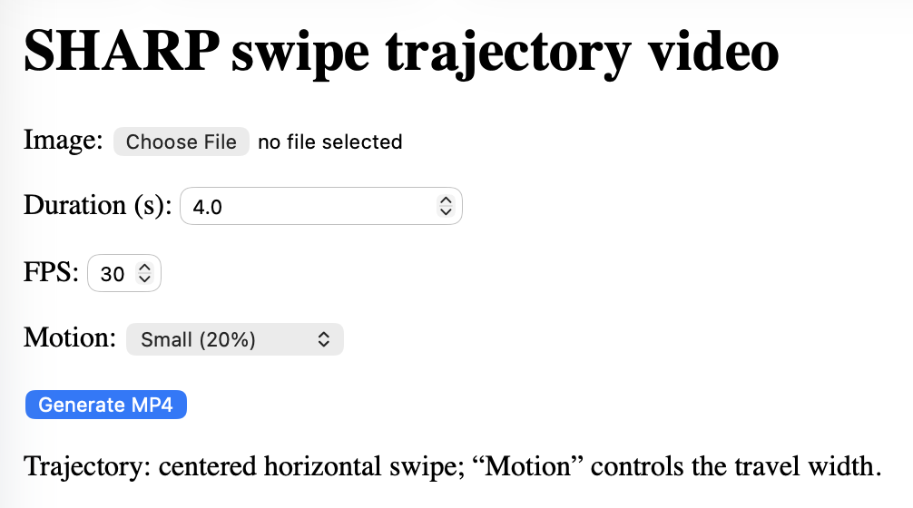
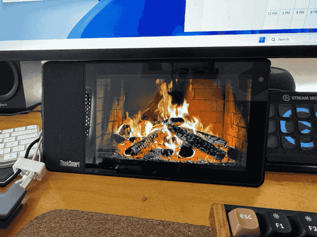

# SHARP (fork)

This is a fork of Apple’s `ml-sharp` repository.

What this fork adds:

- Apple Silicon (MPS) fallback for the included demo video generation.
- A trivial web app to upload a single image and generate a left-to-right “swipe” video.

Upstream project page: https://apple.github.io/ml-sharp/





## Getting started

Install dependencies:

```bash
pip install -r requirements.txt -r requirements-web.txt
```

To test the installation, run

```bash
sharp --help
```

## Using the CLI

To run prediction (upstream behavior):

```bash
sharp predict -i /path/to/input/images -o /path/to/output/gaussians
```

The results will be 3D gaussian splats (3DGS) in the output folder. The 3DGS `.ply` files are compatible to various public 3DGS renderers. We follow the OpenCV coordinate convention (x right, y down, z forward). The 3DGS scene center is roughly at (0, 0, +z). When dealing with 3rdparty renderers, please scale and rotate to re-center the scene accordingly.

### Rendering trajectories (CUDA GPU only)

Additionally you can render videos with a camera trajectory.

- The CLI trajectory renderer (`sharp predict --render` / `sharp render`) uses gsplat and is CUDA-only.
- The web demo can still generate a swipe video on macOS/MPS (or CPU) via the fallback depth-parallax path.

```bash
sharp predict -i /path/to/input/images -o /path/to/output/gaussians --render

# Or from the intermediate gaussians:
sharp render -i /path/to/output/gaussians -o /path/to/output/renderings
```

## Windows + CUDA quickstart

- Install a CUDA-enabled PyTorch build (per [pytorch.org/get-started/locally](https://pytorch.org/get-started/locally/)). For example (CUDA 12.4 wheels):

```powershell
pip install torch==2.8.0 torchvision==0.23.0 --index-url https://download.pytorch.org/whl/cu124
```

- Then install the rest (reuses the extra index so it won’t pull CPU-only wheels):

```powershell
set PIP_EXTRA_INDEX_URL=https://download.pytorch.org/whl/cu124
pip install -r requirements.txt -r requirements-web.txt
```

- `sharp predict` works on Windows. `sharp web` works and will fall back to the depth-parallax renderer if the gsplat renderer is unavailable.
- `sharp render` (gsplat trajectory rendering) targets CUDA on Linux; there are no prebuilt gsplat wheels for Windows. If you need that path, use WSL/Ubuntu or a Linux box.

### WSL + CUDA (untested notes)

If you want gsplat rendering on a Windows box, run inside WSL2 (Ubuntu) with GPU passthrough:

```bash
wsl --update  # on Windows side, once
sudo apt-get update && sudo apt-get install -y python3-venv python3-pip build-essential ffmpeg
python3 -m venv .venv && source .venv/bin/activate
export PIP_EXTRA_INDEX_URL=https://download.pytorch.org/whl/cu124
pip install torch==2.8.0 torchvision==0.23.0  # CUDA wheels
pip install -r requirements.txt -r requirements-web.txt
python - <<'PY'
import torch
print("CUDA available:", torch.cuda.is_available())
if torch.cuda.is_available():
    print(torch.cuda.get_device_name(0))
PY
sharp web --password "test" --port 8000
```

Access it from Windows at `http://localhost:8000`. You can still tunnel with `cloudflared tunnel --url http://localhost:8000` from inside WSL. (Marked untested; report back if you hit issues.)

## Web demo (SHARP motion video)

This repository also includes a tiny web app that accepts a single image and generates a short motion video (swipe / shake / rotate / rotate+push) using SHARP. It shows stage-by-stage progress and queues uploads so multiple friends can submit jobs and they will run one-by-one.

- On CUDA: predicts 3D Gaussians and renders a true camera trajectory via gsplat.
- On macOS/MPS (or CPU): falls back to a depth-based parallax warp driven by SHARP's monodepth sub-network.
- If gsplat is unavailable (e.g., Windows native), CUDA is still used for the depth-parallax fallback path.
- Output: downloadable MP4; inline preview in the UI.

Run locally (no auth needed):

```bash
sharp web
```

Then open `http://127.0.0.1:8000` in your browser. Drag-and-drop a single image (JPG/PNG/HEIC) onto the page or click to browse, choose a render quality preset (Full / High / Balanced / Medium / Social / Small), tweak motion sliders, click “Render.” Progress and device info show in the UI; a download link appears when done. Render quality caps the rendered resolution for both CUDA and fallback; the “Max input side (fallback)” slider (defaults to 1536px) additionally limits the MPS/CPU depth-parallax path; CUDA keeps full-res unless capped by the preset.

### Share a link (ad hoc)

If you want friends to hit your machine over the internet, you need (1) the server listening on a public interface and (2) a public URL (via port-forwarding or a tunnel). This web demo supports simple password protection via HTTP Basic Auth.

1) Pick a password (any string).
2) Run the server publicly (binds to `0.0.0.0` and **requires** `--password`):

   ```bash
   sharp web --public --port 8000 --password "your-password-here"
   ```

3) Create a quick HTTPS link with a tunnel (recommended):

   ```bash
   # cloudflared (free, no account needed for quick tunnels)
   cloudflared tunnel --url http://localhost:8000
   ```

   cloudflared will print a `https://<something>.trycloudflare.com` URL—share that. Friends will see a browser Basic Auth prompt; any username + your password works.

   Alternative: `ngrok http 8000` (requires ngrok account).

You can also port-forward your router’s public port `8000` to your machine’s port `8000` and share `http://<your-public-ip>:8000/` (not recommended without HTTPS).

## Acknowledgements

Our codebase is built using multiple opensource contributions, please see [ACKNOWLEDGEMENTS](ACKNOWLEDGEMENTS) for more details.

## License

Please check out the repository [LICENSE](LICENSE) before using the provided code and
[LICENSE_MODEL](LICENSE_MODEL) for the released models.
